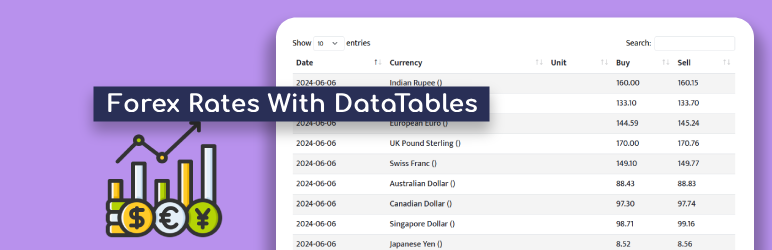
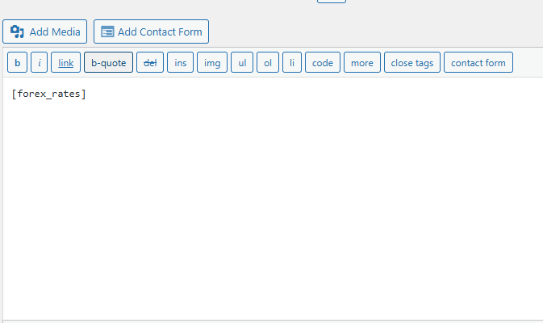
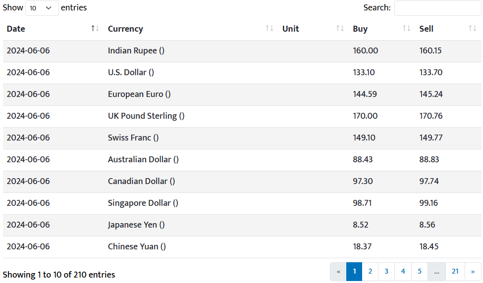

# Forex Rates DataTables

Display foreign exchange rates using DataTables in WordPress. API by https://www.nrb.org.np/api/forex/v1/

## Description

The Forex Rates DataTables plugin allows you to display foreign exchange rates fetched from an API using DataTables. This plugin integrates seamlessly with WordPress, providing a shortcode for easy integration into posts, pages, or widgets.

## Features

- Display foreign exchange rates in a tabular format.
- Customize the date range and number of rates per page.
- Responsive DataTables for optimal viewing on all devices.
- Easy integration with a simple shortcode `[forex_rates]`.

## Installation

1. **Manual Installation:**

   - Upload the `forex-rates-datatables` directory to the `/wp-content/plugins/` directory.
   - Activate the plugin through the 'Plugins' menu in WordPress.

2. **WordPress Dashboard Installation:**

   - Navigate to Plugins -> Add New.
   - Search for "Forex Rates DataTables".
   - Click "Install Now" and then activate the plugin.

## Usage

Once activated, use the `[forex_rates]` shortcode in any post, page, or widget where you want to display the foreign exchange rates table. You can customize the display by setting attributes directly in the shortcode:

## Screenshots

*Caption for Screenshot 1.*

*Caption for Screenshot 2.*

Replace `from`, `to`, and `per_page` attributes with your desired date range and items per page.

## Frequently Asked Questions

### How often is the data updated?

The plugin fetches data from the API in real-time whenever the page with the shortcode is loaded. You can customize the date range to show historical rates.

### Can I customize the styling?

Yes, you can override the plugin's CSS styles by adding custom CSS to your theme's stylesheet or using a custom CSS plugin.

## Changelog

### 1.0
- Initial release

## Support

For support, please visit the [WordPress support forum](https://wordpress.org/support/plugin/forex-rates-datatables/) or [contact us](mailto:info@rabinkc.com.np).

## License

This plugin is licensed under the GPL v2 or later. See [LICENSE.txt](LICENSE.txt) for details.

## Contributing

Contributions are welcome! Please fork the repository and submit a pull request.

## Credits

Developed by [Rabin Kc](https://rabinkc.com.np/).

## Like the Plugin?

If you find this plugin useful, please visit my [LinkedIn Profile](https://www.linkedin.com/in/rabinkc/) for support.

---

© [2024] [Rabin KC]
